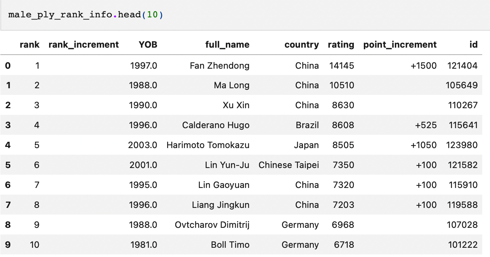
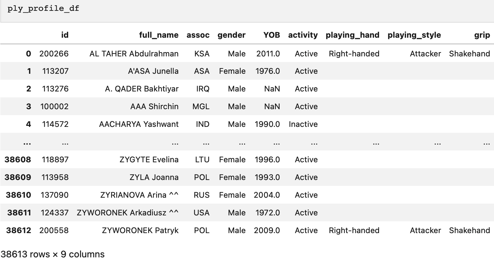
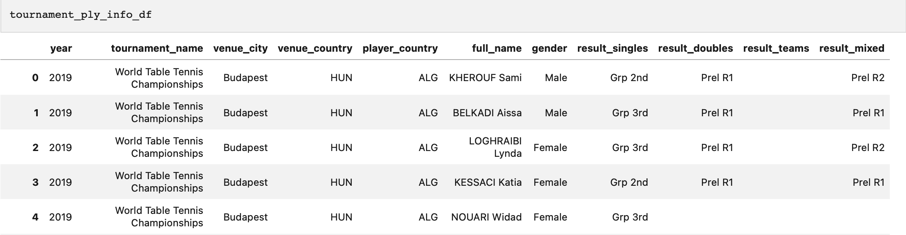

# get_ittf_info

Python package that helps scrape Table Tennis athletes and tournaments information from 'Table Tennis Guide' website and 'ITTF' official website.

## Installation

```bash
$ pip install -i https://test.pypi.org/simple/ get-ittf-info==0.3.3
```

## Usage

The initial incentive for the author to write this package:

The author wants to obtain table tennis players' profiles for analysis, the profile including their rankings, competition results and so on.

On official ITTF website, under '[Player Profile](https://results.ittf.link/index.php?option=com_fabrik&view=list&listid=35&Itemid=155)' , we cannot filter by players'playing hand, playing style and grip method. 

So if we scrape these data we could do our own analysis freely.


- Web data scraping: Extract Table Tennis athletes and tournaments information from  '[Table Tennis Guide](https://tabletennis.guide/rating_ittf.php?gender=1)' website and '[ITTF](https://results.ittf.link/index.php)' official website. Includes:

  - Latest ranking for both male and female table tennis athletes. Ex:

    ```
    male_ply_rank_info = get_ittf_info.grab_ranking_data('Male')
    ```

    

  - Profile for registered atheletes in ITTF system. Ex:

    ```
    ply_profile_df = get_ittf_info.grab_player_data(-1)
    ```

    

  - All previous players participation information in World Table Tennis Championships. Ex:

    ```
    tournament_ply_info_df = get_ittf_info.grab_tournament_data(-1)
    ```

    

- Data visualization: Do some basic analysis of our obtained dataset.

  - Bar chart visualization for the frequency of the selected column of the input dataframe

    ```
    num_of_display = 10
    get_ittf_info.vis_frequency_bar_chart(tournament_ply_info_df,'full_name','full name','frequency','...')
    ```

  - Pie chart  visualization for the percentages of different elements in the selected column of the input dataframe

    ```
    # frequency for different grip method for registered players:
    get_ittf_info.percentage_pie_chart(ply_profile_df,'grip')
    ```

## License

`get_ittf_info` was created by Mengdi Zhang. It is licensed under the terms of the MIT license.

## Credits

`get_ittf_info` was created with [`cookiecutter`](https://cookiecutter.readthedocs.io/en/latest/) and the `py-pkgs-cookiecutter` [template](https://github.com/py-pkgs/py-pkgs-cookiecutter).
